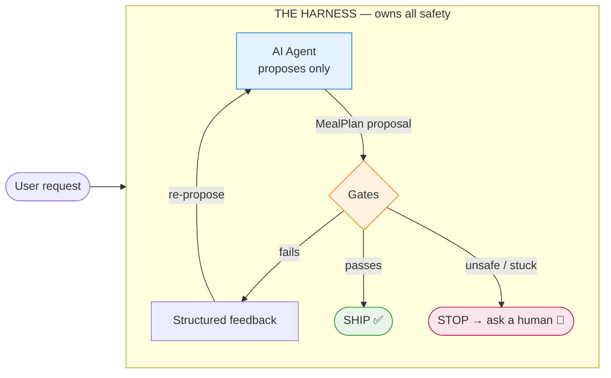
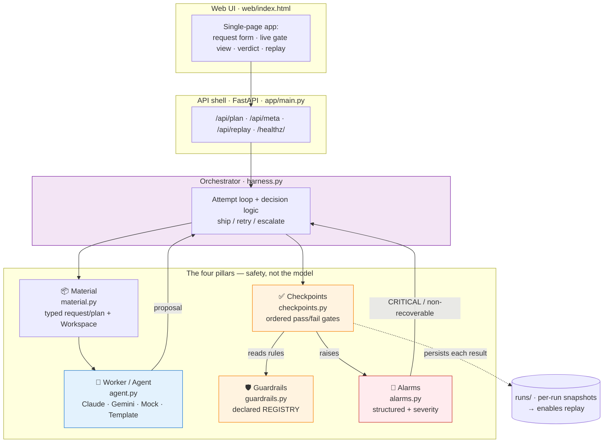
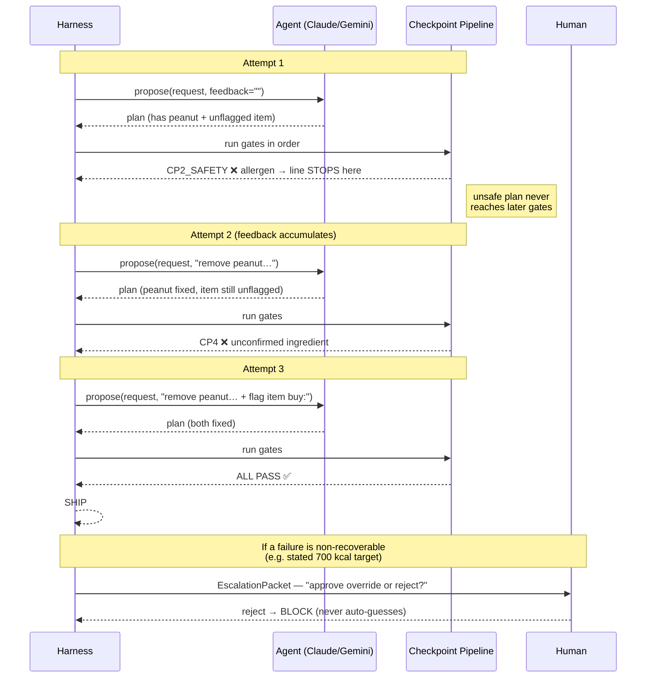
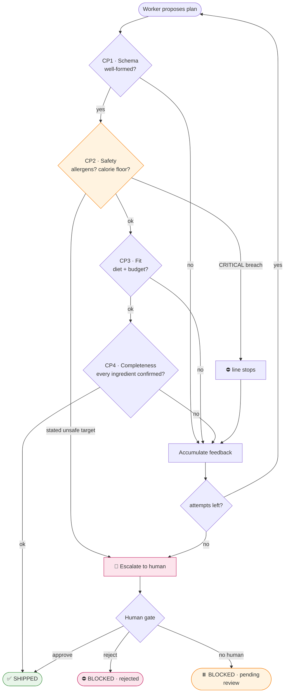
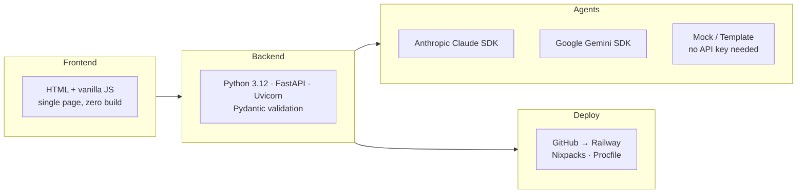

# Meal-Planner Safety Harness — High-Level Design

> A safety harness that an AI meal-planning **agent lives inside**. The agent only *proposes*; the harness alone decides what reaches the user. All safety lives in the gap between **propose** and **apply**.

---

## 1. The real-world problem

People increasingly let AI plan what they eat. But a meal plan is not a chatbot reply — it is acted on. An AI that is *fluent* is not the same as an AI that is *safe*:

| A confident AI can output… | …and a real person gets hurt |
|---|---|
| Peanut butter for a peanut-allergic user | Anaphylaxis |
| A 700 kcal/day "weight-loss" plan | Starvation-level diet, medically unsafe |
| An ingredient nobody confirmed you own | A plan you literally can't cook |

The model produces these confidently, with no flag. **You cannot trust the model to police itself** — the thing generating the plan can't also be the final word on whether it's safe to serve.

## 2. How we address it — *propose vs. apply*

We don't try to build a "safer model." We wrap **any** model in a harness that owns every safety decision. The agent is treated as **powerful but untrusted**: it makes proposals, and nothing it says is authoritative until the harness clears it.

The agent is fully **swappable** because it only speaks one contract: `propose(request, feedback) → plan`. Swap Claude for Gemini for a mock — the safety properties don't move, because they were never in the model.

## 3. System architecture

**The orchestrator only *sequences* the pillars — it reimplements none of them.** That separation is the whole design: safety is composed from four small, independently-true parts.

| Pillar | Role | Key property |
|---|---|---|
| 🛡️ **Guardrails** | *Declare* what "safe" means | Every rule is a data object in one `REGISTRY` — no safety logic hidden in the model |
| ✅ **Checkpoints** | *Gate* the proposal in order | Explicit PASS/FAIL; **SAFETY runs before anything can ship** |
| 📦 **Material** | Move request in / proposal out | Typed & immutable; agent never touches disk → swappable |
| 🚨 **Alarms** | *Signal* what went wrong | Structured (type · severity · context · action), not log lines |

## 4. How the agent works — and how it communicates

The agent never gets the last word, and it never works blind. Each time it fails a gate, the harness hands back a **structured, worker-readable feedback string** describing exactly what to fix. Feedback is **cumulative** — the harness remembers every correction so the agent converges instead of trading one defect for another.

This is the core behavioral guarantee: **the agent's behavior changes in response to the harness**, not the other way around.

## 5. How the final outcome is produced

Every run ends in exactly one verdict. Safety gates **stop the line** — a CRITICAL failure means no later gate even runs, so an unsafe plan can never be "saved" by a downstream check.

| Outcome | Meaning |
|---|---|
| **SHIPPED** | Cleared every gate (possibly after self-correction) |
| **BLOCKED · pending human** | Non-recoverable safety issue, no human wired in → safe default: halt |
| **BLOCKED · rejected** | A human reviewed and declined |
| **BLOCKED · loop exhausted** | Agent couldn't satisfy constraints in budget → escalates, never ships a guess |

Every checkpoint result is **persisted to disk**, so any run can be **replayed from any checkpoint forward without re-invoking the agent** — making safety decisions auditable and reproducible.

## 6. Technology — how it's built

- **Backend:** Python 3.12, FastAPI + Uvicorn, Pydantic for request validation. The core harness is **pure Python with zero third-party deps** — the AI SDKs are imported lazily, so the whole safety engine runs (and is testable) without any API key.
- **Agents:** Claude (`claude-sonnet-4-6`) and Gemini (`gemini-2.5-flash`) as live workers; deterministic Mock + Template workers prove the interface is swappable and demo-able offline.
- **Frontend:** one static HTML page — renders the live gate pipeline, verdict, alarm stream, plan, shopping list, and replay.
- **Deploy:** committed to GitHub, deployed to **Railway** (Nixpacks build, `Procfile` start command, API keys injected as environment variables — never committed).

---

### The one-line pitch

**Don't make the model safe — put the model in a harness that's safe.** The agent proposes; declared guardrails, ordered checkpoints, and a stop-and-ask-a-human gate decide. Swap the model freely; the guarantees never move.
